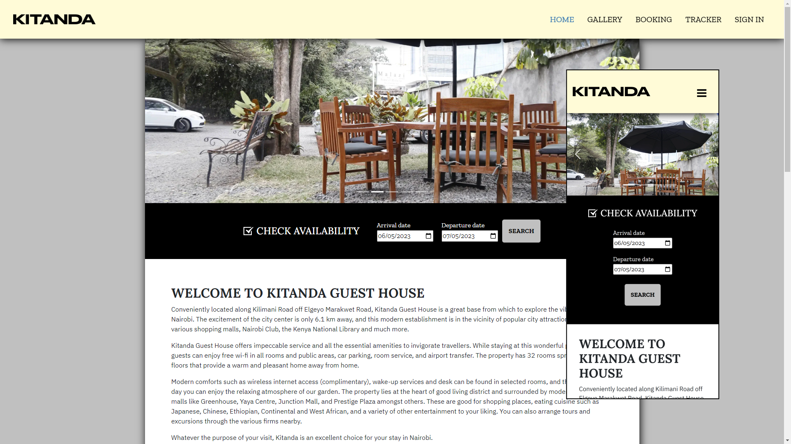
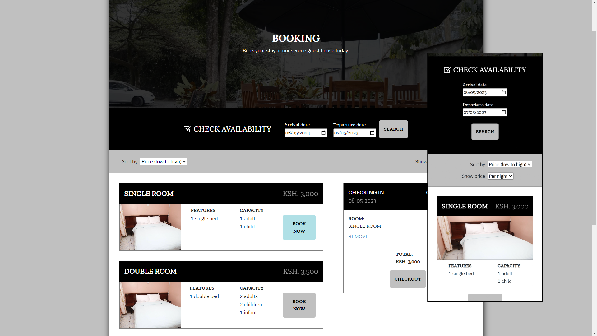
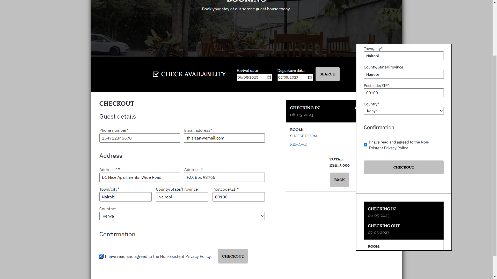
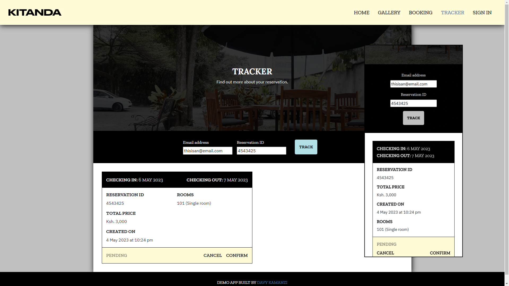

# Kitanda Guest House

This is a portfolio project I did as part of my full stack engineer course on [Codecademy](https://codecademy.com). It is a simple booking app that allows the user to reserve a room from a fictional Kenyan guest house called Kitanda (Kiswahili for "bed"). Users may make reservations without authentication, but registering an account affords the user a better reservation tracking experience, as well as allowing them to save addresses for use in reservations.

## How it was built
### Server
#### Base libraries/techonolgies
- [PostgreSQL](https://www.postgresql.org/) - Open source object-relational database system
- [Node.js](https://nodejs.org/) - JavaScript runtime
- [Express.js](https://expressjs.com/) - Web application framework for Node.js

#### Additional libraries/techonolgies
- [axios](https://axios-http.com/) - Promised-based HTTP client for Node.js and the browser
- [bcrypt](https://www.npmjs.com/package/bcrypt) - Password hashing library for Node.js
- [Cookie Parser](http://expressjs.com/en/resources/middleware/cookie-parser.html) - Express.js middleware for parsing cookies
- [CORS](https://github.com/expressjs/cors) - Express.js middleware for enabling CORS
- [Dotenv](https://github.com/motdotla/dotenv) - Module for loading environment variables from a .env file
- [express-session](https://expressjs.com/en/resources/middleware/session.html) - Express.js framework for managing session middleware 
- [Helmet.js](https://helmetjs.github.io/) - Node.js module for securing HTTP headers
- [iso-3166-1-alpha-2](https://www.npmjs.com/package/iso-3166-1-alpha-2) - Lookup interface for alpha-2 country codes
- [jsonwebtoken](https://www.npmjs.com/package/jsonwebtoken) - Node.js implementation of JSON web tokens
- [node-postgres](https://node-postgres.com/) - Node.js interface for PostgreSQL
- [Passport.js](https://www.passportjs.org/) - Node.js authentication middleware
- [request-ip](https://www.npmjs.com/package/request-ip) - Node.js module for retrieving a request's IP address
- [sanitize-html](https://www.npmjs.com/package/sanitize-html) - HTML sanitiser module
- [Swagger UI](https://swagger.io/tools/swagger-ui/) - REST API documentation tool
  - [swagger-ui-express](https://www.npmjs.com/package/swagger-ui-express) - Express.js interface for Swagger UI  
- [Validator.js](https://github.com/validatorjs/validator.js) - Library of string validators and sanitisers

### Client
#### Base libraries/techonolgies
- [React](https://reactjs.org/) - JavaScript user interface library

#### Additional libraries/techonolgies
- [Bootstrap](https://getbootstrap.com/) - Front-end HTML and CSS framework
  - [React-Bootstrap](https://react-bootstrap.github.io/) - React implementation for Bootstrap
- [Cypress](https://www.cypress.io/) - JavaScript testing framework
- [Jest](https://jestjs.io/) - JavaScript testing framework
- [lightGallery](https://www.lightgalleryjs.com/) - JavaScript image gallery framework
- [React Loading Skeleton](https://www.npmjs.com/package/react-loading-skeleton) - Animated loading skeleton tool
- [React Testing Library](https://testing-library.com/docs/react-testing-library/intro/) - React testing utility
- [Sass](https://github.com/sass/dart-sass) - CSS pre-processor
- [Validator.js](https://github.com/validatorjs/validator.js) - Library of string validators and sanitisers

## Primary functionality
Kitanda Guest House is a multi-page app (MPA) with a basic design that is accessible from desktop, tablet and mobile devices with all modern browsers, with Lighthouse scores of 70 for performance, 97 for accessibility, 92 for best practices, and 100 for SEO (full report can be viewed by [clicking here](./readme/wpt-lighthouse.pdf), while a JSON of the app's [WebPageTest](https://www.webpagetest.org/) run can be viewed by [clicking here](./readme/wpt-result.json)).

### Home page
The app's home page gives the user an overview of the guest house and its amenities, while also providing a Google map of its location and a booking form at the top of the page.

### Booking flow
From the home page, users may conduct a search for available rooms between the specified dates. Clicking the "Search" button takes them to the Booking page, where available room types are displayed for the user to reserve.

Upon adding desired room types to the cart, the user may then click the "Checkout" button, which displays a form with details to fill out before making the reservation.

Once the reservation is made, the app displays the reservation ID to the user for use in the Tracker page, where the user is required to enter their email and a reservation ID to view the status of their reservation. The user may also cancel the reservation or confirm it by making a payment via [M-Pesa](https://www.safaricom.co.ke/personal/m-pesa), a mobile money transfer service available in Kenya.

## Future work
The primary work remaining to be done on this project is writing an end-to-end test (which I haven't been able to yet because [Cypress keeps freezing my PC at the moment](https://github.com/cypress-io/cypress/issues/26583)), as well as server tests.

## Links
- Repository: [github.com/DavyK17/kitanda-guest-house](https://github.com/DavyK17/kibandaski)
- Live link: [kitanda-guest-house-production.up.railway.app](https://kitanda-guest-house-production.up.railway.app/)

## Author
- GitHub: [@DavyK17](https://github.com/DavyK17)
- Website: [davyk17.github.io](https://davyk17.github.io)
